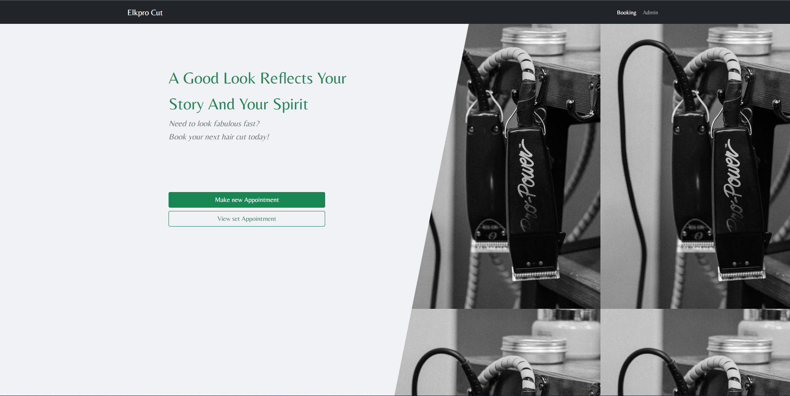
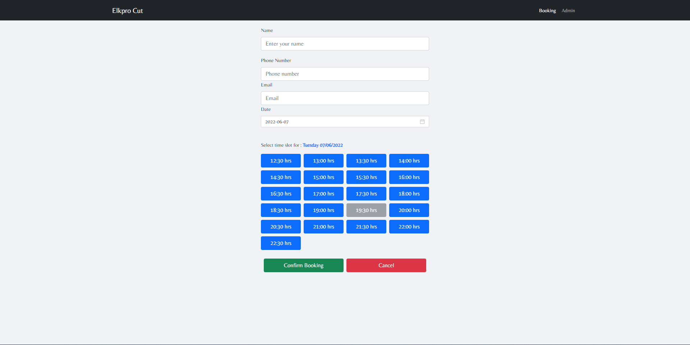
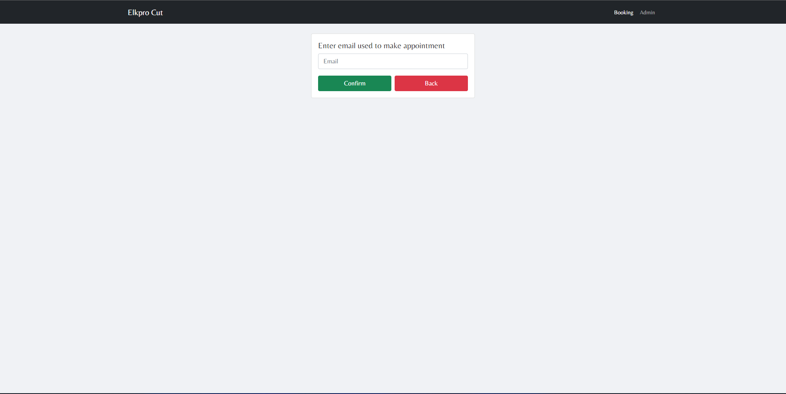

# Web BookingApplication 🔥

> [Deployed Here](https://elkpro.netlify.app)

- Pull requests are welcome!!!

:star: Follow me on GitHub

### Website Preview

#### Home Page

#### Booking Page

#### View Set Appoitment Page

## Features 📋

⚡️ Fully Responsive\
⚡️ Valid HTML5 & CSS3\

## Tools Used 🛠️

- <b>Netlify</b> - To host my static website (HTML, CSS, JS).
- <b>Firebase</b> - For backend functionality

## Contributing 💡

#### Step 1

- **Option 1**

  - 🍴 Fork this repo!

- **Option 2**
  - 👯 Clone this repo to your local machine.

#### Step 2

- **Build your code** 🔨🔨🔨

## License

- **[MIT license](http://opensource.org/licenses/mit-license.php)**
